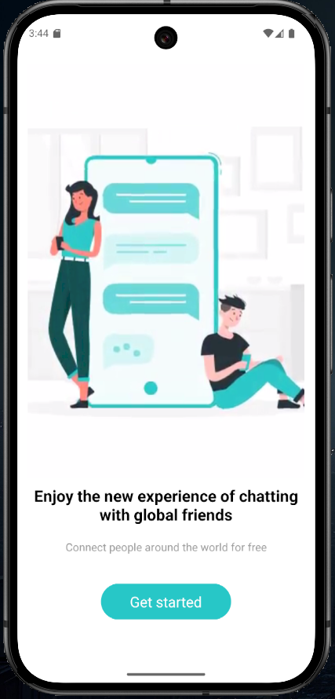
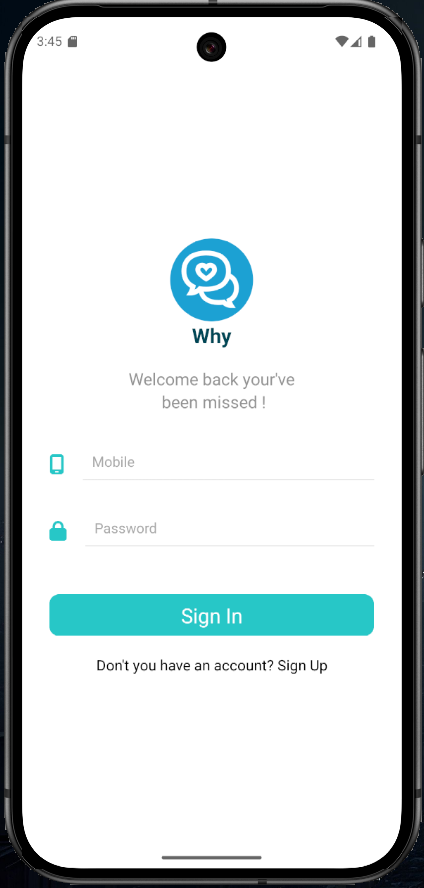
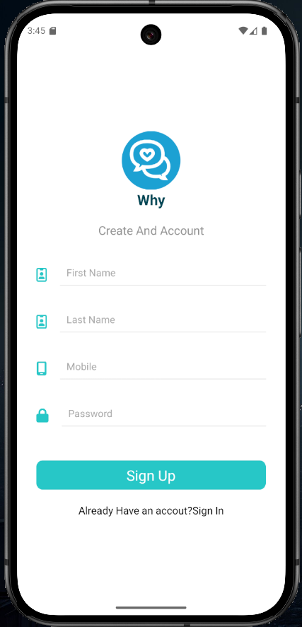
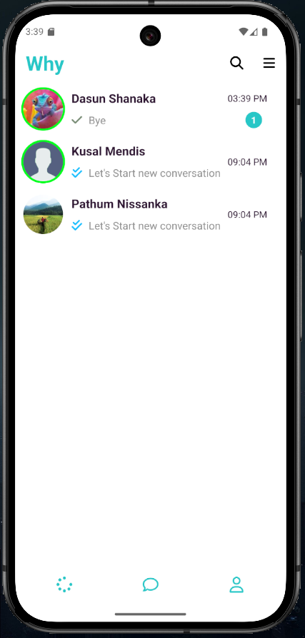
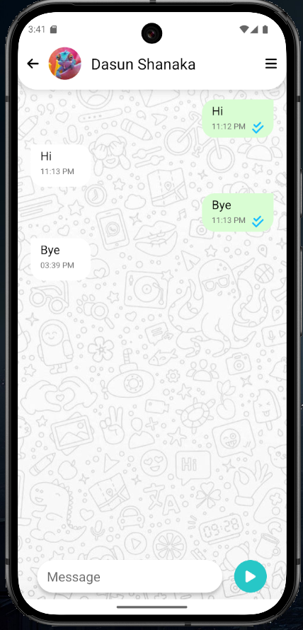
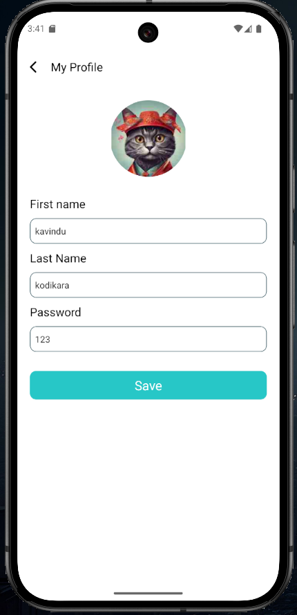

# WhyChat

WhyChat is a real-time mobile chat application combining the power of **React Native** for an intuitive and dynamic frontend with **Spring Boot** providing a robust and scalable backend. The frontend is designed with smooth animations, user-friendly navigation, and responsive design elements to enhance user interaction. The backend utilizes Spring Boot's comprehensive framework for developing secure REST APIs, handling real-time communication via WebSockets, and managing data storage with MySQL. Together, these technologies create a seamless chat experience with real-time updates, profile customization, and interactive UI components.

## Technologies Used

### Frontend
- React Native
- React Navigation
- Animated components for UI/UX
- Fetch API for API requests

### Backend
- Spring Boot
- WebSockets for real-time communication
- MySQL for data persistence

## Overview

WhyChat provides a comprehensive mobile chat experience:
- **User Authentication**: Animated SignIn and SignUp pages for account creation and login.
- **Home Page**: Displays all user chats with profile pictures, online statuses, chat names, last messages, and message statuses (seen/unseen).
- **Single Chat Page**: Dedicated interface for chatting between users.
- **Profile Page**: Allows users to edit profile details and upload profile pictures.

### Project Repositories
- **Frontend Repository (React-Native)**: [Link to Frontend Repo](https://github.com/kavindu-kodikara/WhyChat-Frontend.git)  
- **Backend Repository (Spring Boot)**: [Link to Backend Repo](https://github.com/kavindu-kodikara/WhyChat-Backend.git)

## Detailed Breakdown

### 1. SignIn/SignUp Pages
The SignIn and SignUp pages feature visually appealing animations that enhance the user experience while creating an account or logging in.

#### Features:
- Account creation with validation
- Smooth animated transitions
- Secure login

   
### 2. Home Page
The home page lists all available chats with key details for each conversation.

#### Features:
- Profile pictures
- Online/offline status indicators
- Chat names and last message previews
- Seen/unseen message statuses

### 3. Single Chat Page
This is where users can exchange messages in real-time.

#### Features:
- Smooth message sending and receiving
- Real-time updates with WebSockets

### 4. Profile Page
Users can manage their personal details and profile picture.

#### Features:
- Profile editing (name, email, etc.)
- Profile picture upload

## Backend Features
- Spring Boot for a scalable server-side solution
- WebSocket support for real-time communication
- MySQL database integration for secure data storage

## Disclaimer
**This project is intended for demonstration and educational purposes only. Any attempt to publish or redistribute this project as your own is prohibited and will be considered a violation of copyright.**

## License
This project is licensed under the [MIT License](LICENSE.md).

